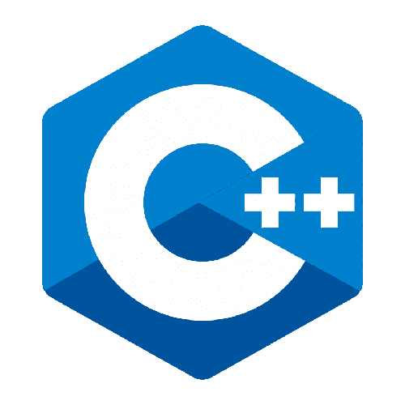
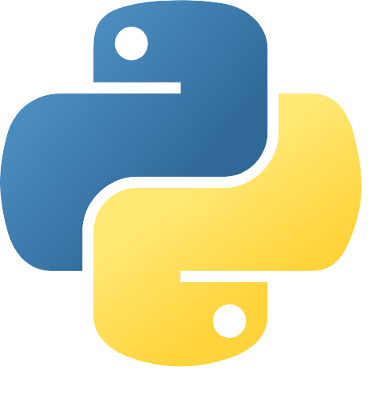

<h1 align="center"><strong>
    Edgar's ISC Repository
</strong></h1>

<h1 align="center"><strong>
    Aguascalientes Polythecnic University
</h1>
</strong></h1>

<h1 align="center"><strong>
        Units
</strong></h1>

<h2><strong><ul>
    <li><a href = "https://github.com/UP210614/UP210614_CPP/tree/main/U1">
      Unit 1 Programming introduction
    </a></li>
     
    <li><a href = "https://github.com/UP210614/UP210614_CPP/tree/main/U2">
      Unit 2 Control structures and cycles	
    </a></li>
     
    <li><a href = "https://github.com/UP210614/UP210614_CPP/tree/main/U3">Unit 3 Functions	</a></li>
     
    <li><a href = "https://github.com/UP210614/UP210614_CPP/tree/main/U4">Unit 4 Files and arrays</a></li>
</ul>
</strong>
</h2>
<h1>
<h1 align="center"><strong>
        Git 
</strong></h1>

  <table>
    <tr> 
      <th>Git commands</th>
      <th>Usage</th>
    </tr>
     <tr> 
      <td>Git clone</td>
      <td>Clones a repository.</td>
    </tr>
    </tr>
     <tr> 
      <td>Git pull</td>
      <td>Downloads content from a remote repository.</td>
    </tr>
    </tr>
     <tr> 
      <td>Git add</td>
      <td>Adds changes to files in the next commit.</td>
    </tr>
    </tr>
     <tr> 
      <td>Git commit</td>
      <td>Commits changes to files.</td>
      </tr>
     <tr> 
      <td>Git push</td>
      <td>Uploads the committed files to github.</td>
    </tr>
    </tr>
  </table>

