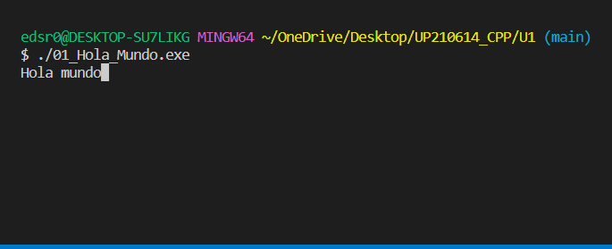
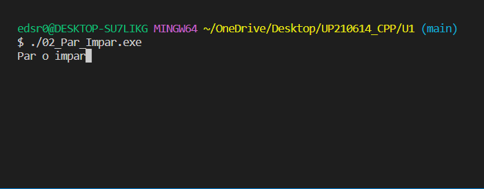
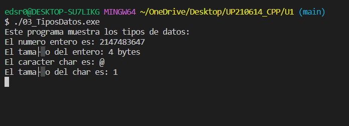
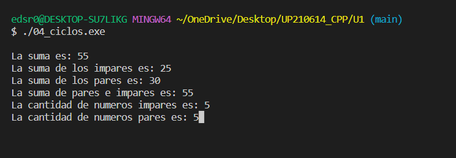
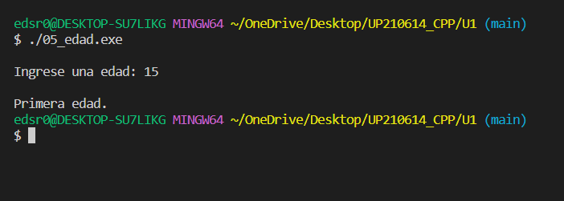

# Programas Unidad 1

## 1. Hola mundo

Este código tiene como objetivo imprimir el mensaje   
"Hola mundo".

- - -
```
int main(){

    cout<<"Hola mundo";

    getchar();
    return 0;
}
```


- - - 

## 2. Par o Impar

Este código tiene como objetivo imprimir el mensaje   
"Par o impar".

- - -
```
#include <iostream>
using namespace std;

int main(){

    cout<<"Par o impar";

    getchar();
    return 0;
}
```


- - - 

## 3. Tipos de datos

Este código tiene como objetivo imprimir los tipos de datos en c++.

- - -
```
#include <iostream>

#include <stdio.h>
using namespace std;

int main(){
    
    int entero = 2147483647;
    float flotante = 3.1416e4;
    double grande = 2.565465654654;
    char caracter = '@';

    cout<<"Este programa muestra los tipos de datos: \n";
    cout<<"El numero entero es: "<<entero<<endl;
    cout<<"El tamaño del entero: "<<sizeof(entero)<<" bytes"<<endl;
    cout<<"El caracter char es: "<<caracter<<endl;
    cout<<"El tamaño del char es: "<<sizeof(caracter)<<endl;


    getchar();
    return 0;
}
```


- - - 

## 4. Ciclos

Este código tiene como objetivo demostrar la suma de lo números pares e impares utilizando ciclos.

- - -
```
#include <iostream>
using namespace std;

int main()
{

    int n = 10, s = 0, p = 0, imp = 0, pc = 0, impc = 0;

    for (int i = 1; i <= n; i++)
    {
        s += i;
        if (i % 2 == 0)
        {
            p += i;
            pc += 1;
        }
        else
        {
            imp += i;
            impc += 1;
        }
    }

    cout << endl
         << "La suma es: " << s;
    cout << endl
         << "La suma de los impares es: " << imp;
    cout << endl
         << "La suma de los pares es: " << p;
    cout << endl
         << "La suma de pares e impares es: " << imp + p;
    cout << endl
         << "La cantidad de numeros impares es: " << impc;
    cout << endl
         << "La cantidad de numeros pares es: " << pc;
    getchar();
    return 0;
}

```


- - - 

## 5. Edad

Este código tiene como objetivo capturar una edad y utilizar condicionales para decirte en que etapa de edad te encuentras.

- - -
```
#include <iostream>
using namespace std;

int main()
{

    int edad;

    cout << endl
         << "Ingrese una edad: ";
    cin >> edad;

    if (edad > 0 && edad <= 150)
    {

        if (edad <= 30)
        {
            cout << endl
                 << "Primera edad.";
        }
        else if (edad > 30 && edad < 61)
        {
            cout << endl
                 << "Segunda edad.";
        }
        else if (edad > 60 && edad < 91)
        {
            cout << endl
                 << "Tercera edad.";
        }
        else if (edad > 90 && edad <= 150)
        {
            cout << endl
                 << "Ya robas oxigeno.";
        }
    }
    else
    {
        cout << endl
             << "Esa edad no existe.";
    }

    getchar();
    return 0;
}
```


- - - 